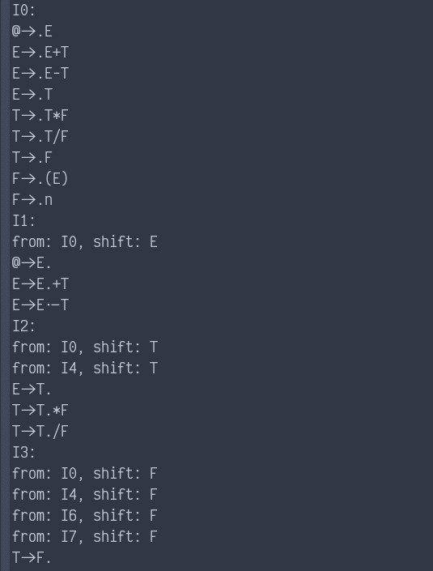
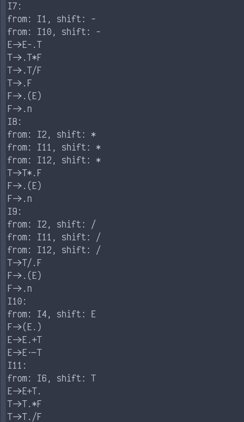
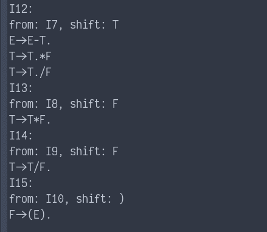
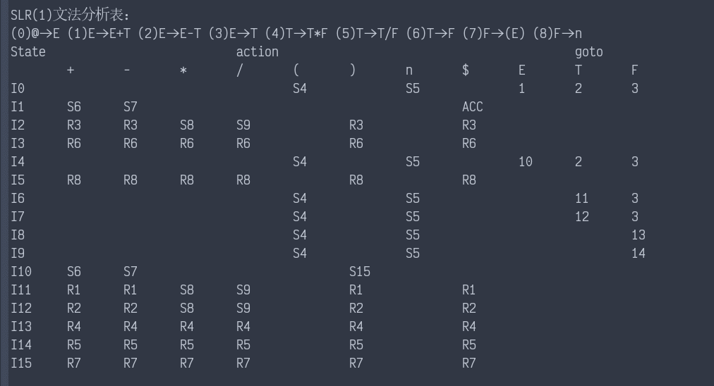
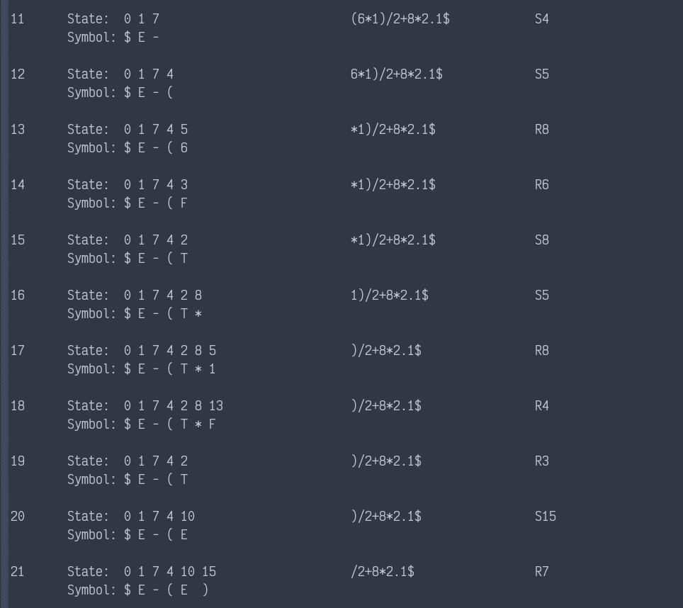

# Table of Contents

1.  [运行截图](#org6c6c232)
2.  [如何运行](#orgc5ab2fb)
3.  [程序功能](#org351ec9e)
4.  [程序逻辑](#org3a4c14c)
5.  [程序结构体](#org7384552)
6.  [程序全局变量](#orgee6353c)
7.  [程序函数](#orgb0ad3c2)

# 运行截图

-   文法串识别和 FIRST/FOLLOW
    
    

-   求得的项目族
    
    
    
    
    
    
    
    

-   文法分析表
    
    

-   待约串分析动作表
    
    
    
    
    
    
    
    

# 如何运行

-   Windows
    
    点击 lr.exe 即可

-   Linux
    
    ./lr\_linux

-   MacOS
    
    ./lr\_mac

# 程序功能

1.  读取存储满足要求的文法串的文件
    
    文法的要求：
    
    1.  设计正确的 SLR(1)文法
    2.  文法串中的大写字母表示非终结符，小写字母(除 n)和符号(除@)表示终结符，n表示数字
    3.  不同文法串用换行符分隔
2.  分析输入的文法串
    1.  输出文法中的非终结符和终结符
    2.  输出文法中非终结符的 FIRST, FOLLOW 集
    3.  输出 SLR(1)形式的文法项目族
    4.  输出 SLR(1)形式的分析表
3.  读取存储待约串的文件（不同待约串按行分隔）
4.  输出所有待约串的分析过程（可以检测无法推出的待约串）

# 程序逻辑

1.  读取输入的文法串
2.  求输入文法串的 FIRST/FOLLOW 集
3.  求文法规范项目族
4.  求文法分析表
5.  读取输入的待约串集
6.  对每一条待约串进行语法分析并输出分析动作表

# 程序结构体

1.  expMap: 存储文法串
    -   start:  文法串的开始符号
    -   subExp: 文法串的产生式
2.  source: 用来确定来源项目集
    -   from:  项目集来源的序号
    -   shift: 移进的符号
3.  solu: 项目集
    -   sources: 此项目集的来源
    -   list:    此项目集中的文法串
    -   isTran:  项目集中的文法串是否被遍历
4.  place: 二维序号
    -   x: 项目集序号
    -   y: 项目集中产生式序号
5.  table: 文法分析表
    -   action: action 表
    -   goTo: goto 表
6.  stack: 状态符号栈
    -   state:  状态
    -   symbol: 符号
7.  doline: 分析动作表的一行
    -   no: 步骤
    -   st: 状态符号栈
    -   s:  当前状态下的剩余符号串
    -   do: 分析动作

# 程序全局变量

1.  oriBegin:    拓广之前的文法开始符号
2.  begin:       拓广之后的文法开始符号
3.  beginSubExp: 拓广之后的文法开始符号的产生式
4.  vCnt:        非终结符计数
5.  tCnt:        终结符计数
6.  vs:          非终结符的 map
7.  ts:          终结符的 map
8.  exps:        文法串数组
9.  first:       文法 FIRST 集
10. follow:     文法 FOLLOW 集
11. flag:       标志某非终结符（用于求 FOLLOW 集）
12. solus:      文法项目族
13. aTable:     文法分析表
14. inputArr:   输入待约串集
15. cInput:     当前规约串
16. aDoTable:   分析动作表
17. errIndex:   当前规约串中错误位置

# 程序函数

1.  push(st stack, sta int, sym string) stack
    -   用途
        
        将新的状态和栈顶符号压栈
    
    -   参数
        
        st: 要操作的栈
        
        sta: 新的栈顶状态
        
        sym: 新的栈顶符号
    
    -   返回值
        
        压栈之后的栈

2.  pop(st stack) stack
    -   用途
        
        弹栈
    
    -   参数
        
        st: 要进行弹栈操作的栈
    
    -   返回值
        
        弹栈之后的栈

3.  peek(st stack) (int, string)
    -   用途
        
        返回栈顶状态和符号
    
    -   参数
        
        要求栈顶状态和符号的栈
    
    -   返回值
        
        int:    栈顶状态
        string: 栈顶符号

4.  isEmpty(st stack) bool
    -   用途
        
        判断栈是否为空
    
    -   参数
        
        要判断的栈
    
    -   返回值
        
        栈是否为空

5.  subPeekSta(st stack, popLen int) int
    -   用途
        
        返回规约之后的次栈顶状态
    
    -   参数
        
        st:     要分析的栈
        
        popLen: 规约产生式的长度
    
    -   返回值
        
        规约之后的次栈顶状态

6.  analysis()
    -   用途
        
        分析待约串集合

7.  getDoTable(input string) (error, int)
    -   用途
        
        得到当前待约串的分析动作表
    
    -   参数
        
        input: 当前待约串
    
    -   返回值
        
        error: 分析过程中发生的错误
        
        int:   发生错误的位置

8.  distNum(offset int, term string, isNum bool) (error, int)
    -   用途
        
        区别当前符号是否数字的同时，构造一条分析动作
    
    -   参数
        
        offset: 当前符号的长度
        
        term: 当前符号
        
        isNum: 是否为数字
    
    -   返回值
        
        error: 分析过程中发生的错误
        
        int:   发生错误的位置

9.  getADoline(input string, no int) doline
    -   用途
        
        构造一个基础的分析动作
    
    -   参数
        
        input: 此动作对应的剩余分析串
        
        no:    此动作对应的步骤
    
    -   返回值
        
        doline: 构造好的分析动作

10. cut(s string) (int, res string, kind string)
    -   用途
        
        截取当前剩余的符号串
    
    -   参数
        
        s: 当前的剩余符号串
    
    -   返回值
        
        int:  截取出的符号的长度
        
        res:  截取出的符号
        
        kind: 截取出符号的类型

11. readInput(fName string)
    -   用途
        
        从文件读取待约符号串集
    
    -   参数
        
        存储待约符号串集的文件名

12. initialize()
    -   用途
        
        初始化需要初始化的全局变量

13. readGrammar(fName string)
    -   用途
        
        从文件读取文法集
    
    -   参数
        
        存储文法集的文件名

14. outputGrammar()
    -   用途
        
        输出文法相关信息

15. getTable()
    -   用途
        
        生成文法分析表

16. mapSubExp(subExp string) int
    -   用途
        
        映射产生式和序号
    
    -   参数
        
        产生式
    
    -   返回值
        
        产生式的序号

17. mapShift(shift rune, isT bool) int
    -   用途
        
        映射终结符/非终结符的序号
    
    -   参数
        
        shift: 符号
        
        isT：  是否为终结符
    
    -   返回值
        
        符号对应的序号

18. findTo(from int, shift rune) int
    -   用途
        
        获取要到达的项目集序号
    
    -   参数
        
        from:  起始项目集的序号
        shift: 当前移进的符号
    
    -   返回值
        
        int: 要到达的项目集的符号

19. getClosure()
    -   用途
        
        获取文法的项目族

20. isSoluExist(list []expMap) (bool, int)
    -   用途
        
        判断此项目集是否已经在项目族中存在
    
    -   参数
        
        list: 要进行判断的项目集
    
    -   返回值
        
        bool: 是否存在
        int:  如果存在即为与之相同的项目集编号

21. isEnd(isBack bool) (bool, place)
    -   用途
        
        判断是否遍历完整个项目族
    
    -   参数
        
        isBack: 是否用来求文法分析表
    
    -   返回值
        
        bool:  遍历是否结束
        place: 当前未被遍历的项目集中产生式的位置

22. closure(iMap expMap) []expMap
    -   用途
        
        求某个产生式对应的闭包
    
    -   参数
        
        iMap: 产生式
    
    -   返回值
        
        []expMap: 此产生式对应的闭包

23. getNextMap(start rune) []expMap
    -   用途
        
        获得下一个要求闭包的产生式集
    
    -   参数
        
        start: 产生式的开始符号
    
    -   返回值
        
        []expMap: 开始符号对应的产生式集

24. addDot(p int, oriExp string) string
    -   用途
        
        为没有加点的产生式加点
    
    -   参数
        
        p:      加点的位置
        oriExp: 要加点的产生式
    
    -   返回值
        
        string: 加点之后的产生式

25. moveDot(p int, oriExp string) string
    -   用途
        
        将有点的产生式中的点向后移动一位
    
    -   参数
        
        p: 点在产生式中的位置
        
        oriExp: 要移动点位置的产生式
    
    -   返回值
        
        string: 移动点之后的产生式

26. firstAndFollow()
    -   用途
        
        构造并输出 FIRST, FOLLOW 集

27. getFirst(start rune) []rune
    -   用途
        
        求 FIRST 集
    
    -   参数
        
        start: 要求 FIRST 集的非终结符
    
    -   返回值
        
        []rune: start 对应的 FIRST 集

28. getFollow(start rune) []rune
    -   用途
        
        求 FOLLOW 集
    
    -   参数
        
        start: 要求 FOLLOW 集的非终结符
    
    -   返回值
        
        []rune: start 对应的 FOLLOW 集

29. isExist(c rune, cArr map[int]rune) bool
    -   用途
        
        判断符号是否存在
    
    -   参数
        
        c:    要进行判断的符号
        cArr: 符号对应的 map
    
    -   返回值
        
        bool: 符号是否存在

30. getVT(iStr string)
    -   用途
        
        求非终结符和非终结符
    
    -   参数
        
        iStr: 要进行分析的文法串

31. printChar(charMap map[int]rune)
    -   用途
        
        打印识别出的符号
    
    -   参数
        
        符号对应的 map

32. printStr(strArr []string)
    -   用途
        
        打印字符串集合
    
    -   参数
        
        strArr: 字符串集合

33. printExpMap(expArr []expMap)
    -   用途
        
        打印文法
    
    -   参数
        
        expArr: 文法集合

34. printF(f map[rune][]rune)
    -   用途
        
        打印 FIRST, FOLLOW 集
    
    -   参数
        
        FIRST/FOLLOW 集

35. printClosure()
    -   用途
        
        打印闭包

36. printTable()
    -   用途
        
        打印文法分析表

37. getMaxStLen() int
    -   用途
        
        获取当前动作分析表中最大栈长度
    
    -   返回值
        
        当前动作分析表中最大栈长度

38. printDoTable()
    -   用途
        
        打印动作分析表

